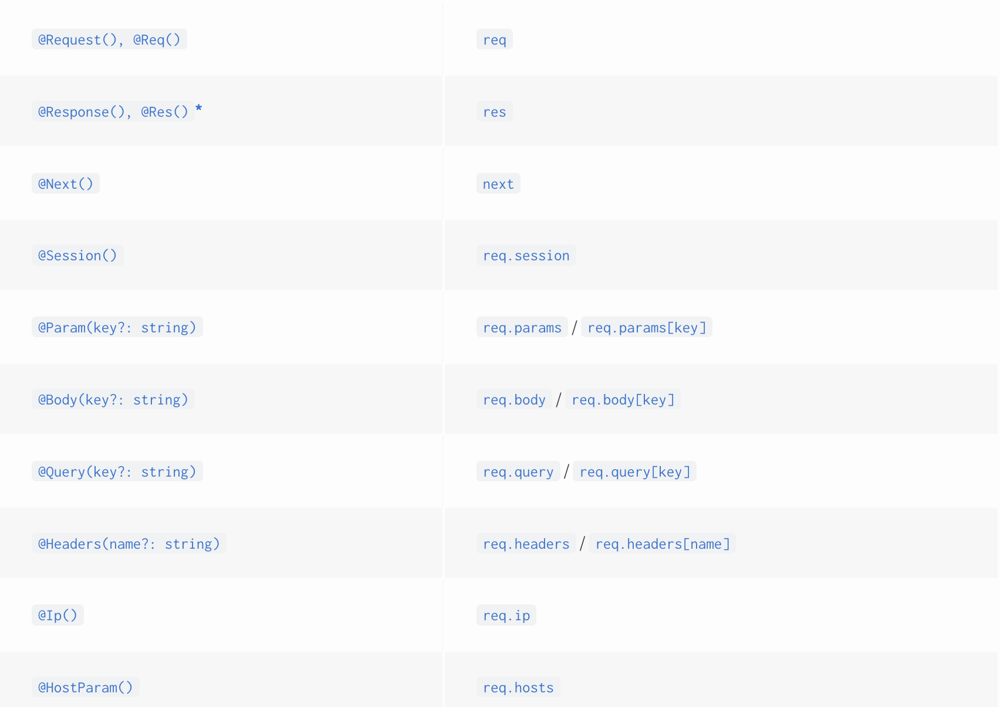

# Controllers（控制器）

控制器负责处理传入的请求并返回对客户的响应。


控制器的目的是接收该应用程序的特定请求.路由机制控制哪个控制器接受哪个请求，每个控制器都有多个路由，不同的路由可以执行不同的操作。
为了创建基本控制器，我们使用类和装饰器（decorators）。基于元数据的装饰器与类做关联，创建一个Nest的路由映射图。（绑定请求到对应的控制器上）。

:::tip
如果你想快速的创建一个使用内置[验证器（validation）](https://docs.nestjs.com/techniques/validation)的CRUD应用，你可以使用[NEST CLI生成器](https://docs.nestjs.com/recipes/crud-generator#crud-generator)的能力。 nest g resource [name].
:::

## Routing（路由）

下面的例子中，我们会使用@Controller()装饰符，它被用来定义一个Controller（控制器）。我们将指定一个前缀是cats的路由。这种形式可以让我们快速的对路由进行分组，同时降低代码重复。

```Js
import { Controller, Get } from '@nestjs/common';

@Controller('cats')
export class CatsController {
  @Get()
  findAll(): string {
    return 'This action returns all cats';
  }
}
```

:::tip 使用CLI快速创建一个Controller
`nest g controller [name]`
:::

在上面的示例中，当向此终端发出get请求时，则会请求到用户预先定义的`findAll`方法。这个方法会返回status code（状态码）为200的相关的响应，在这里就是一个字符串。这是如何发生的？为了解释，我们首先介绍Nest采用两种不同选择来操纵响应的概念：

- **Standard 标准式**
  这种模式下，当一个handler（处理器）内部返回一个JS对象或者数组，将自动将其转换为JSON。当返回JS的原生类型（String Number Boolean etc...）,Nest不会做任何处理。

  此外StatusCode一般都是200，除了POST请求使用201。我们可以改变这个行为通过`@HttpCode()`装饰器。
- **Library-specific 具体库模式**
  我们可以使用具体的库的（eg,Express）响应对象。可以在handler的签名上使用`@Res()`装饰器 `(e.g., findAll(@Res() response))`.通过这种形式你可以使用被那个对象暴露的原生的响应处理方法。比如在Express中，你可这么写`response.status(200).send().`
  
:::warning
当你使用@Res @Next装饰符的时候，NEST就认为你使用library-specific mode.此时standard mode就被禁用了。如果要同时使用这两种模式（比如通过注入对象只是去设置Cookie/headers,但是剩下的工作仍然交给框架）你必须设置`passthrough`为true. `@Res({ passthrough: true })`
:::

## Request object （请求对象）

handler通常需要访client请求数据。通常我们使用`@Req()`装饰器。

```js
import { Controller, Get, Req } from '@nestjs/common';
import { Request } from 'express';

@Controller('cats')
export class CatsController {
  @Get()
  findAll(@Req() request: Request): string {
    return 'This action returns all cats';
  }
}
```

:::tip
为了发挥express的类型优势，需要安装`@types/express` package。
:::

Request object不仅代表了HTTP请求而且有request query string, parameters, HTTP headers, 和 body [(read more here)](https://expressjs.com/en/api.html#req)这么多属性。一般情况下不需要你手动去获取他们。我们可以直接使用独立的装饰器比如`@Body() or @Query()` 下面是一些常用的装饰器列表


为了兼容多基础平台(eg. express and fastify),Nest提供了`@Res @Response()` 装饰符`@Res`是`@Response`的别名。这两个都可以直接暴露原生的response对象。当使用原生对象的时候，你应该同时导入其TS类型，以发挥类型优势。注意当你在一个方法中注入@Res或@Response时，此时该Handler就变成了Library-specific mode，所以需要你去管理你自己的response.

## Resources
